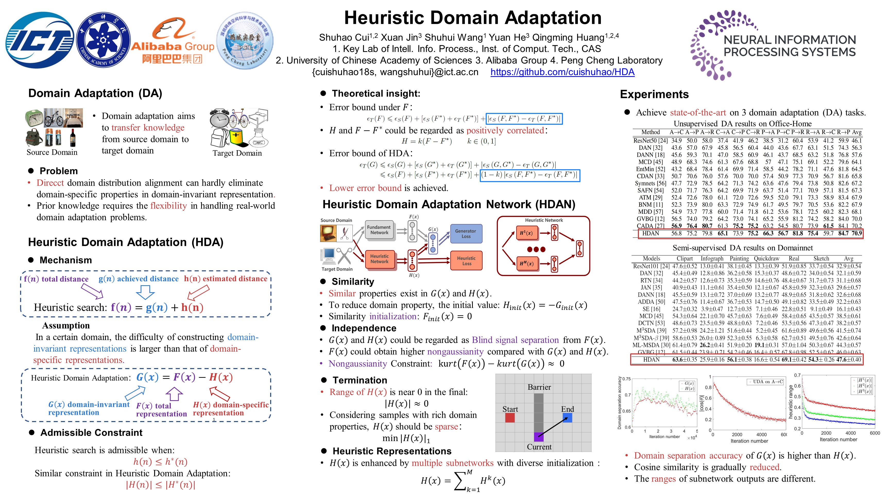

# HDA implemented in PyTorch
code release for ["Heuristic Domain Adaptation"](https://arxiv.org/abs/2011.14540)(NIPS2020)
## One sentence highlight
We address the construction of domain-invariant and domain-specific representations from the heuristic search perspective.
## Poster

<div>

<div>

  
## Enviroment
- pytorch = 1.3.0
- torchvision = 0.4.1
- numpy = 1.17.2
- pillow = 6.2.0
- python3.7
- cuda10

To install the required python packages, run

```
pip install -r requirements.txt
```

## Dataset

Office-Home dataset can be found [here](http://hemanthdv.org/OfficeHome-Dataset/).

Domainnet dataset can be found [here](http://ai.bu.edu/M3SDA/).

The training of HDA could be utilized by changing the path of the dataset, such as the txt files in [data/UDA_officehome/Art.txt](./data/UDA_officehome/Art.txt).

Also, the txt files for SSDA and MSDA should be compressed.

```
cd data
unzip data.zip
```

## Train
### UDA on Office-Home
```
bash scripts/run_uda.sh
```

### MSDA on Domainnet
```
bash scripts/run_msda.sh
```

### SSDA on Domainnet
```
bash scripts/run_ssda.sh
```

## Citation
If you use this code for your research, please consider citing:
```
@inproceedings{cui2020hda,
 author = {Cui, Shuhao and Jin, Xuan and Wang, Shuhui and He, Yuan and Huang, Qingming},
 booktitle = {Advances in Neural Information Processing Systems},
 pages = {7571--7583},
 publisher = {Curran Associates, Inc.},
 title = {Heuristic Domain Adaptation},
 volume = {33},
 year = {2020}
}


```

## Contact                                                                                                                                                                       
If you have any problem about our code, feel free to contact
- hassassin1621@gmail.com

or describe your problem in Issues.

[Note](https://zhuanlan.zhihu.com/p/318547208)

[量子位](https://zhuanlan.zhihu.com/p/309479647)

Supplemantary could be found in [google driver](https://drive.google.com/file/d/17qfbwqsT2YsJDObyq0lHH8EHqt2T62CE/view?usp=sharing) and [baidu cloud](https://pan.baidu.com/s/1bQ-Z_LQFA7xokon7C_-NeA) with 8yut.
